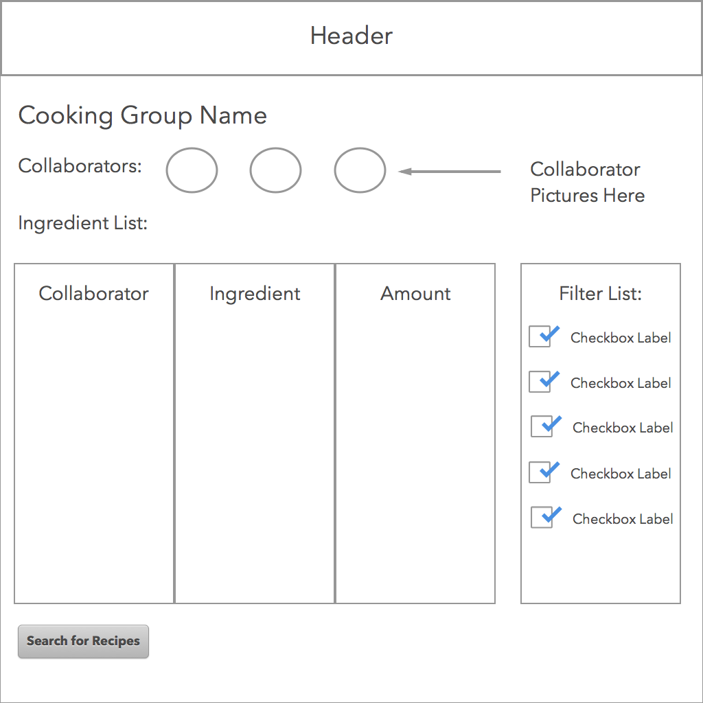
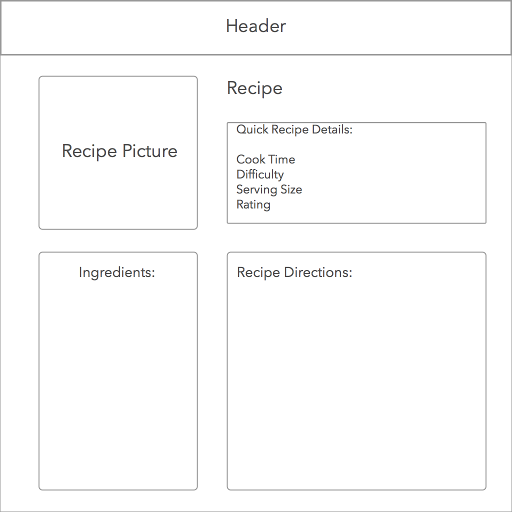
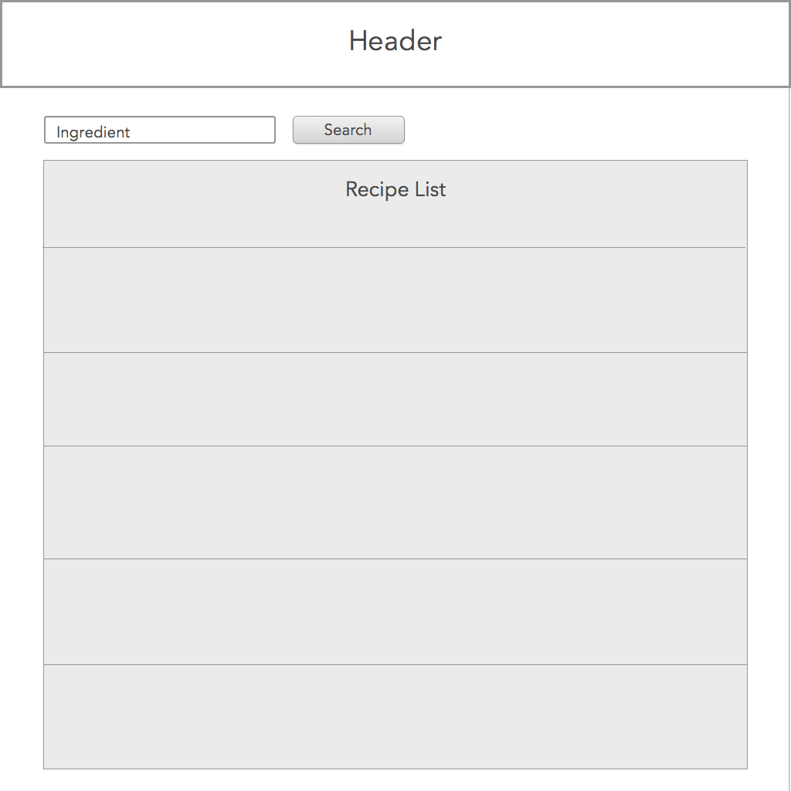
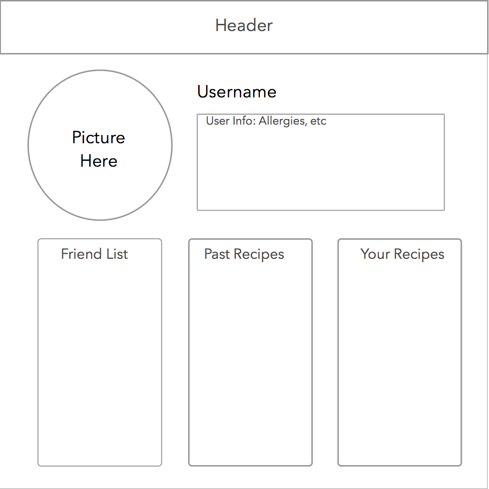

#comp20-spring2015-team14

##CookWithFriends- Project Proposal

##Project Title: CookWithFriends

**Problem Statement:** Collaborative cooking is difficult to plan.

**How do you solve the problem?:** We will design a website that allows multiple people to input the
ingredients they have in their houses. Based on this information, the website will generate a list of potential recipe matches based on the ingredients available, and the dietary restrictions and preferences of the group.

**List of all features that your team will implement**
 1. Simultaneous ingredient entry and meal planning collaboration among friends.
 2. View of a complete ingredient list with contributor info (e.g. “Frozen Veggies : Aditi”, "Paprika : Thomas")
 3. Utilize filters for recipes, e.g. “vegetarian,” “dairy-free,” “low calorie,” “short cook time,” "gluten free, “easy,” "breakfast", "desert" etc.
 4. “Cooking groups,” where users are all contributing to the same ingredient list
 5. A method of saying how many ingredients a group and what they still need in order to make the recipe
 6. User accounts/profiles

**Technologies**
 * *Bootstrap:* We will use Bootstrap for our front-end framework design
 * *Client-side data persistence:* Store ingredient lists,
 * *Server-side data persistence:*
  1. We will store data about user’s dietary restrictions and food preferences to more accurately come up with good    suggestions.
  2. We will store information about a users friends, and connections. In a way, a social network for cooking       e   enthusiasts.
  3. we will allow users to input their own recipes which we will store as part of our database.
  
* *Send emails, SMSes, or push notifications:* We will notify users about invitations to cook, or potential recipe       changes.
* *Data scraping:* The web-app will scrape cooking and recipe websites for potential recipes using the ingredients available.
* *Geolocation(Potential Feature):* Use geolocation to find users near you who have similar food preferences and are looking for people to cook with
 
##What data will your prototype be using and collecting
 1. Collecting ingredient list- types of food
 2. Using recipes off of external websites to provide back to client
 3. representations of internal recipes entered by users, stored on-site

## Any algorithms or special techniques that will be necessary
 * We will use a search algorithm to find a list of recipes that fit the group’s criteria.

##APIs:
* Facebook API: Integration of facebook login as a quick way of adding friends and connections
* google search API: to search the web for potential recipe matches

## Mockups

The group collaboration page consists of information about the cooking group: cooking group name, the names of the collaborators in the group, and the group member’s account pictures. The page also consists of the shared ingredients that belong to the group members. The ingredients list consists of the collaborator’s name, the ingredient, and the amount of that ingredient that he has. The collaborators also have the option to narrow down the kinds of recipe that they want to search for. The right side of the page is devoted to the list of filtered options such as gluten free recipes, vegetarian recipes, etc. Lastly, at the bottom of the page resides the “search for recipes” button that forwards the user to the recipe search page.

The recipe page is the page giving the user details about the recipe that he wants to make. The recipe page consists of the recipe name, picture, the quick recipe details, which are the same details listed on the recipe search page, the list of ingredients, the amount of each ingredient needed, and the recipe directions. 

The recipe search page is the page that will appear after a group has compiled a group of ingredients and they search for all the recipes that they can make. Each recipe will consist of the recipe name, picture, rating, time it takes, and difficulty level. The users can click on each recipe name and will get sent to the recipe page to find out more details about the recipe.

The user profile page is the account page for every user. This page consists of a picture of user, which would also be the individual’s profile picture on Facebook if he decides to link the page to his Facebook. As well, the page includes the user’s name, relevant information about them (food allergies, etc), their friends/connections, past recipes he has made, and recipes that he has uploaded to the website.

